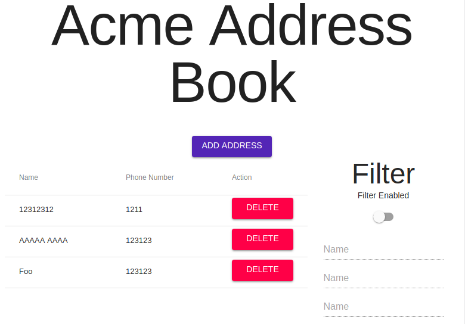

# Address book demo

## Tech Stack

Node/Express with a json database on the backend

React/Redux/Redux-Saga/material UI on the front end. 

## Getting it running. 

The scripts in the root directory should work. 

## Tests

### Frontend

in the frontend directory, run `npm test`. 

I wrote tests for one of the selectors, and one of the sagas. 

### Backend
 
No backend tests. 

